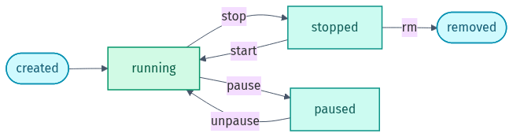

# Part 1 — Docker Basics (Warm-up)

*A container's lifecycle — created → running → stopped → removed:*

<picture><source media="(prefers-color-scheme: dark)" srcset="../docs/03-container-lifecycle-dark.png"></picture>

## 🎯 Goal
Refresh the everyday Docker commands so the Dockerfile and Compose parts feel easy.

## 🧠 What you practise here
| Command | What it is for |
|---------|----------------|
| `docker run` | Start a container from an image |
| `docker ps` | See running (or all) containers |
| `docker logs` | Read a container's output |
| `docker exec` | Run a command / shell inside a container |
| `docker images` | List images you have locally |
| `docker stop` / `rm` / `rmi` | Clean up containers and images |
| `docker build` | Build an image from a Dockerfile |
| `docker system prune` | Free disk space |

---

## 📝 Tasks
Run each one in your terminal. Answers are at the bottom. (These use public images, so they download the first time.)

1. **Hello world.** Run the `hello-world` image and watch the message.
2. **Run a web server.** Start `nginx` in the background, named `web`, mapping host port 8080 to container port 80. Open `http://localhost:8080`.
3. **List.** Show the running containers, then show **all** containers (including stopped ones).
4. **Logs.** Show the logs of the `web` container.
5. **Get inside.** Open a shell inside `web` and run `ls /usr/share/nginx/html`, then exit.
6. **Stop & remove.** Stop `web` and remove it.
7. **Images.** List your local images, then remove the `hello-world` image.
8. **Run with an env var.** Run `alpine` so it prints an environment variable you set, e.g. `GREETING=hi`.
9. **One-off command.** Use `alpine` to print the current date, removing the container afterwards.
10. **Disk usage.** Show how much disk Docker is using, then remove stopped containers.

---

## ✅ Answers

```bash
# 1. Hello world
docker run --rm hello-world

# 2. Run nginx in the background
docker run -d --name web -p 8080:80 nginx

# 3. List
docker ps          # running only
docker ps -a       # all, including stopped

# 4. Logs
docker logs web    # add -f to follow live

# 5. Get inside
docker exec -it web sh
#   (now inside) ls /usr/share/nginx/html
#   (now inside) exit

# 6. Stop & remove
docker stop web
docker rm web

# 7. Images
docker images
docker rmi hello-world

# 8. Run with an env var
docker run --rm -e GREETING=hi alpine sh -c 'echo $GREETING'

# 9. One-off command
docker run --rm alpine date

# 10. Disk usage + cleanup
docker system df
docker container prune
```

➡️ When you are comfortable, move on to [Part 2 — Dockerfiles](../02-dockerfiles/README.md).

---

## ⭐ Found this useful?
Please **star** ⭐, **fork** 🍴, and **share** 🔗 this repo on LinkedIn so others can use it too. Want to add a task or fix something? See [CONTRIBUTING.md](../CONTRIBUTING.md).

Made by **Shubham Sharma** · [GitHub](https://github.com/shubhs248) · [LinkedIn](https://www.linkedin.com/in/shubhs248)
