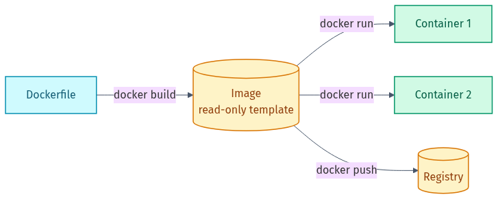
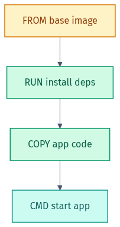
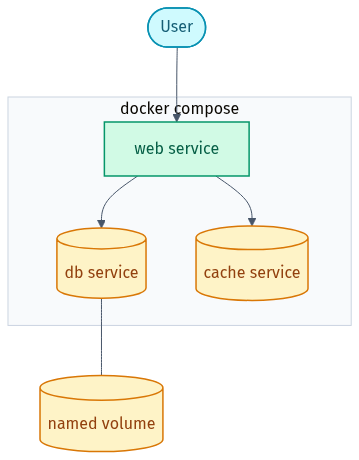

# 🖼️ Diagram Gallery — Docker

Rendered diagrams for this lab in **light + dark**. They adapt to your GitHub theme below; grab the files directly for slides or LinkedIn.

- Light: `NN-name.png` / `.svg` · Dark: `NN-name-dark.png` / `.svg`
- Editable Mermaid source lives in [`src/`](src). Re-render from the repo root with `render-diagrams.ps1`.

## 🎨 Colour legend
| Colour | Means |
|--------|-------|
| 🔵 Cyan | source / user / state |
| 🟢 Teal / Green | containers & build steps |
| 🟠 Amber | images / registry / volumes |

---

### Dockerfile → image → containers
Build once into an image; run it as many containers; push to a registry to share.

<picture><source media="(prefers-color-scheme: dark)" srcset="01-image-vs-container-dark.png"></picture>

### Image layers
<picture><source media="(prefers-color-scheme: dark)" srcset="02-image-layers-dark.png"></picture>

### Container lifecycle
<picture><source media="(prefers-color-scheme: dark)" srcset="03-container-lifecycle-dark.png"></picture>

### Docker Compose architecture
<picture><source media="(prefers-color-scheme: dark)" srcset="04-compose-architecture-dark.png"></picture>

---

Made by **Shubham Sharma** · [GitHub](https://github.com/shubhs248) · [LinkedIn](https://www.linkedin.com/in/shubhs248)
